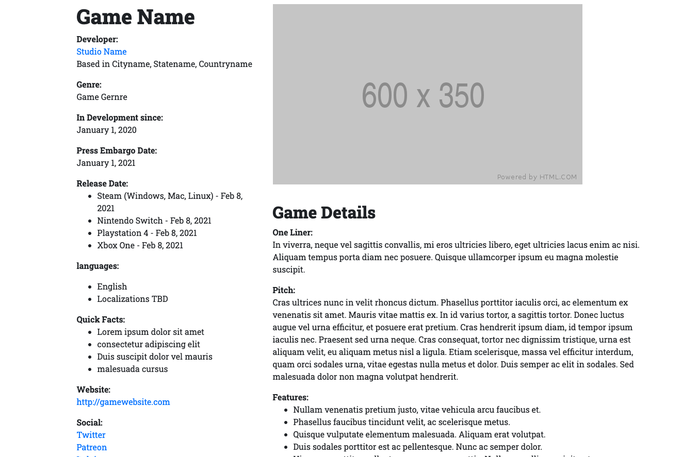
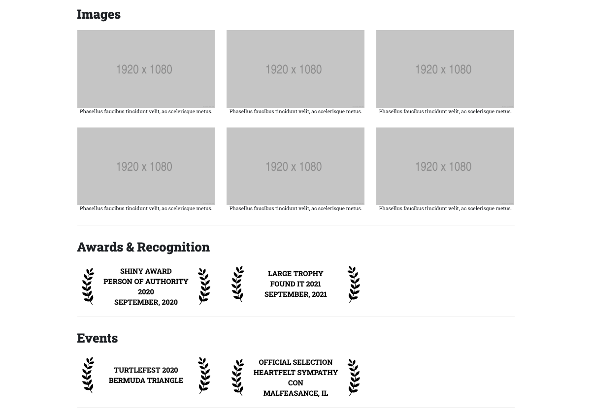

# m-press
Easily design press pages for your projects such as games or other works.
Generates static html - easy to host - nothing to install on a server.

## Prerequisites

- Install node for your platform (https://nodejs.org/en/download/)[https://nodejs.org/en/download/]

## Usage

- Clone this repo `git clone git@github.com:AlexBezuska/m-press.git mPress`.
- Run `npm install` in the terminal to install m-press' dependencies.
- Make a copy of the data folder and name it something like "my-cool-project".
- Edit `config.js` and make the `dataPath` the data folder you made for your project.
- Edit the `Press.json`file with the information for your project.
- Run `npm start` in the terminal to build the output html files, they will appear in the 'output' folder.
- Upload the `press.html` file to your server or host of choice!
